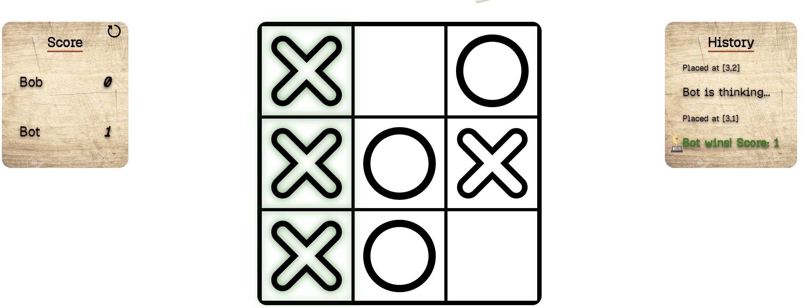

# Tic Tac Toe

A vanilla **JavaScript, HTML & CSS** Tic Tac Toe game, built as a project for [The Odin Project](https://www.theodinproject.com/) curriculum.

## Features

- **PvP mode** where player can play with their friend
- **PvE mode** where player faces a simulated bot with random decision-making
- **Win detection** with the winning cells highlighted before the board refreshes
- **Score board** with a reset option
- **History board** showing whose turn, placed position and the winner notification
- **Beginning dialog** that gives beginner a tutorial

## Concepts I practiced

- **Objects & factory functions** — `createPlayer` returns a player object that can manipulate own score variable.
- **Closures** — private environments that keeps internal data secure like player score and board matrix.
- **IIFEs** — `gameBoard`, `domHandler`, and `gameManager` are all self-invoking IIFEs that limit the use of global variables.

## modules

The game consists of four modules:

| Module | Type | Job |
|---|---|---|
| `gameBoard` | IIFE | Contains the 3×3 backend matrix. `decideGameState()` checks every row, column, and diagonal, returning a `[state, winningCells]` pair. |
| `createPlayer` | Factory function | Builds a player object; uses closures to keep `score` private and only upate by `scoreIncrement` / `scoreReset`. |
| `domHandler` | IIFE | Leads the whole game progression. It first renders the intro dialog, the mode-select dialog. After gameStart event, it builds score board, history board, and game board. Attaching cell click listeners that update both the DOM and `gameBoard`, and handles bot-move simulation.|
| `gameManager` | IIFE | Tracks global game variables and provide helper method: current turn, current mode, and the two player objects. |
